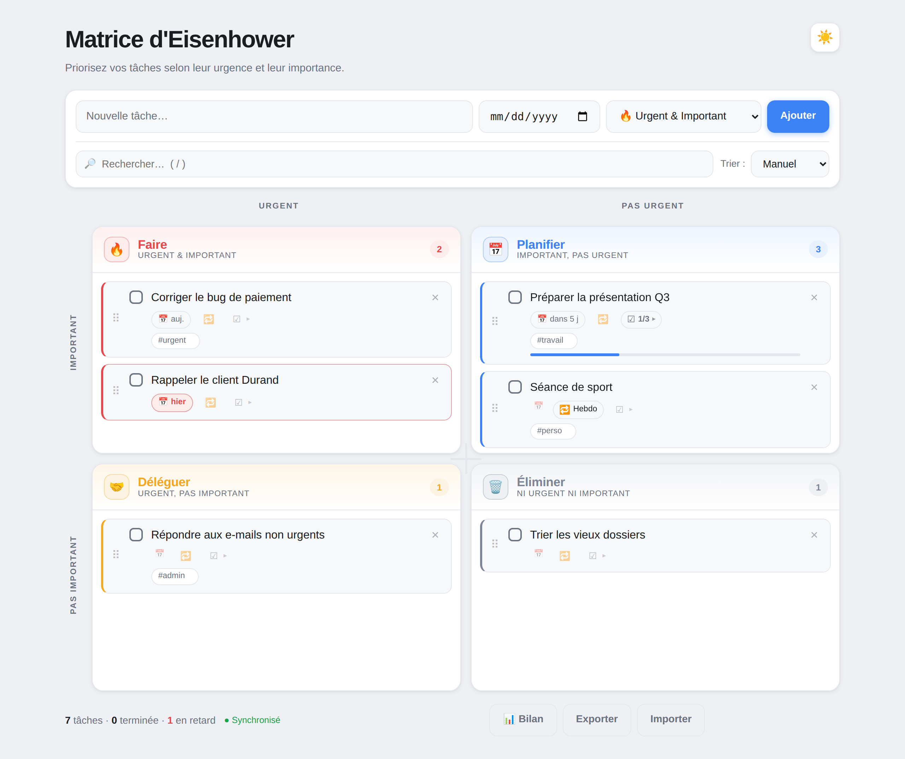

<h1 align="center">🗂️ Matrice d'Eisenhower</h1>

<p align="center">
  Un organiseur de tâches <b>auto-hébergé</b> basé sur la <b>matrice d'Eisenhower</b> :<br>
  priorisez selon l'<b>urgence</b> et l'<b>importance</b>, sans distraction.
</p>

<p align="center">
  
  
  
  
  
</p>

<p align="center">
  <picture>
    <source media="(prefers-color-scheme: dark)" srcset="docs/screenshot-dark.png">
    
  </picture>
</p>

---

## 🧭 Le principe

La méthode d'Eisenhower classe chaque tâche selon **deux axes** — son **urgence** et son **importance** — pour décider quoi en faire :

|                    | 🔥 Urgent                | 📅 Pas urgent      |
| ------------------ | ------------------------ | ------------------ |
| **Important**      | **Faire** tout de suite  | **Planifier**      |
| **Pas important**  | **Déléguer**             | **Éliminer**       |

Cette application transpose ces 4 quadrants dans une interface claire, rapide et sans fioritures.

## ✨ Fonctionnalités

- **Les 4 quadrants** — Faire · Planifier · Déléguer · Éliminer, avec libellés d'axes (Urgent / Important).
- **Glisser-déposer** des tâches entre quadrants et **réordonnancement** à l'intérieur (souris + tactile).
- **Quadrants redimensionnables** — poignées glissables, ratio mémorisé (double-clic pour réinitialiser).
- **Échéances** avec dates relatives (« auj. », « demain », « dans 3 j », « en retard ») et surlignage des retards.
- **Saisie en langage naturel** — taper « Appeler le client demain » ou « Réunion 15/08 » remplit l'échéance et nettoie le titre.
- **Tâches récurrentes** (quotidien / hebdo / mensuel) : cocher reprogramme à la prochaine occurrence.
- **Sous-tâches / checklists** avec barre de progression, éditables en ligne.
- **Étiquettes `#tags`** filtrables, saisies directement dans le titre.
- **Recherche**, **tri** (échéance, récence, alphabétique), **annulation** de suppression.
- **Thème clair / sombre** (auto ou manuel), **PWA** installable et fonctionnelle **hors-ligne**.
- **Synchronisation multi-appareils** via un petit backend (téléphone ↔ ordinateur).
- **Bilan hebdomadaire** (terminées / créées / en retard, répartition par quadrant).
- **Rappels par e-mail** et **notifications push** quotidiens.
- **Google Agenda dans les deux sens** (tâches → agenda via flux ICS, agenda → tâches via import).
- **Sauvegardes automatiques** quotidiennes des données.

## 🚀 Démarrage rapide

```bash
git clone https://github.com/RAMEENZ/Eisenhower_Matrice.git
cd Eisenhower_Matrice
python3 server.py
```

Puis ouvre <http://localhost:8000>. C'est tout — **aucune dépendance à installer** pour l'usage de base (Python 3 suffit). Tu peux même ouvrir `index.html` directement : l'appli fonctionne en local, les tâches sont conservées dans le navigateur.

Variables d'environnement principales :

| Variable | Défaut | Rôle |
|---|---|---|
| `PORT` | `8000` | Port d'écoute |
| `BIND` | `127.0.0.1` | Adresse d'écoute |
| `EISENHOWER_DATA` | `./data` | Dossier de stockage |

## ⌨️ Raccourcis clavier

| Touche | Action |
|---|---|
| `/` | Aller à la recherche |
| `n` | Nouvelle tâche |
| `Échap` | Vider la recherche / annuler une édition en cours |

## 🧱 Architecture

| Composant | Rôle |
|---|---|
| `index.html` · `style.css` · `app.js` | Interface (aucune dépendance, aucun build) |
| `sw.js` · `manifest.webmanifest` | Service worker + PWA (hors-ligne, installable) |
| `server.py` | Serveur statique **+ API de synchro** `/api/state`, flux ICS, rappels, push, import agenda — **stdlib Python uniquement** |
| `data/` | État (`state.json`), sauvegardes, clés — généré à l'exécution, jamais versionné |

Les tâches vivent dans le `localStorage` du navigateur **et**, si le backend est joignable, sont synchronisées entre appareils (versionnage optimiste, fusion sans perte).

## ⚙️ Fonctions optionnelles

Toutes sont **désactivées par défaut** et s'activent par variables d'environnement (par ex. via un `EnvironmentFile` systemd).

<details>
<summary><b>📧 Rappels par e-mail</b></summary>

```bash
SMTP_HOST=smtp.gmail.com
SMTP_PORT=587
SMTP_USER=vous@example.com
SMTP_PASS=mot_de_passe_application   # Gmail : mot de passe d'application
REMINDER_TO=vous@example.com
REMINDER_HOUR=8                       # heure d'envoi (0-23)
```

Test : `python3 server.py --send-reminder-now [--dry-run]`
</details>

<details>
<summary><b>🔔 Notifications push (Web Push / VAPID)</b></summary>

Nécessite la seule dépendance externe du projet, `pywebpush` :

```bash
python3 -m venv .venv
.venv/bin/pip install pywebpush
.venv/bin/python server.py --gen-vapid        # génère data/vapid_private.pem
.venv/bin/python server.py                    # lance avec push activé
```

Puis, dans l'appli (en **HTTPS**), clique « 🔔 Activer les notifications ».
Le rappel quotidien envoie alors aussi une notification push.
</details>

<details>
<summary><b>📅 Google Agenda (deux sens, sans OAuth)</b></summary>

**Tâches → Agenda** : le serveur publie un flux iCalendar protégé par un jeton secret.
L'URL s'affiche au démarrage ; abonne-la dans Google Agenda (« À partir de l'URL »).

**Agenda → Tâches** : lecture périodique d'une adresse secrète iCal.

```bash
GCAL_ICS_URL=https://calendar.google.com/calendar/ical/…/private-…/basic.ics
GCAL_IMPORT_QUADRANT=q2      # quadrant des tâches importées
GCAL_IMPORT_DAYS=30          # fenêtre (jours)
GCAL_POLL_MIN=30             # intervalle de lecture (minutes)
```

Test : `python3 server.py --sync-gcal-now`
> ⚠️ N'importe pas l'agenda dans lequel tu as abonné le flux (un garde-fou anti-boucle est intégré).
</details>

## 🌐 Déploiement (exemple : systemd + Cloudflare Tunnel)

Service systemd type :

```ini
[Service]
WorkingDirectory=/opt/eisenhower
Environment=PORT=8000
Environment=BIND=127.0.0.1
Environment=PYTHONUNBUFFERED=1
EnvironmentFile=-/etc/eisenhower.env
ExecStart=/opt/eisenhower/.venv/bin/python /opt/eisenhower/server.py
Restart=on-failure
```

Le service n'écoute qu'en local (`127.0.0.1`) ; un **tunnel Cloudflare** expose le site en HTTPS sans ouvrir le moindre port. Optionnel : **Cloudflare Access** pour restreindre l'accès (penser à exclure le chemin `/calendar/*` pour que Google puisse lire le flux).

## 💾 Sauvegardes & confidentialité

À chaque écriture, une sauvegarde datée est créée dans `data/backups/` (une par jour, rétention `BACKUP_KEEP` = 14 par défaut). L'export / import JSON depuis l'interface offre une sauvegarde manuelle.

En mode local, rien ne quitte l'appareil. En mode synchronisé, les tâches transitent vers **votre propre serveur**. L'API n'a pas d'authentification intégrée : si le site est exposé publiquement, protégez-le (Cloudflare Access, réseau privé…). Aucun secret (clés, mots de passe, jetons) n'est stocké dans le dépôt — tout vit dans `data/` et l'`EnvironmentFile`, hors versionnage.

## 🧪 Tests & outillage

Le backend expose des commandes utilitaires :

| Commande | Effet |
|---|---|
| `--send-reminder-now [--dry-run]` | Envoie (ou simule) le récapitulatif e-mail / push |
| `--sync-gcal-now` | Force une synchronisation Google Agenda |
| `--gen-vapid` | Génère les clés VAPID pour les notifications push |

Le frontend se prête à des tests de bout en bout via un navigateur sans tête (rendu des quadrants, synchro, thème, dates naturelles, récurrence, étiquettes, bilan…).

## 📄 Licence

Distribué sous licence **[Unlicense](LICENSE)** — domaine public, faites-en ce que vous voulez.
